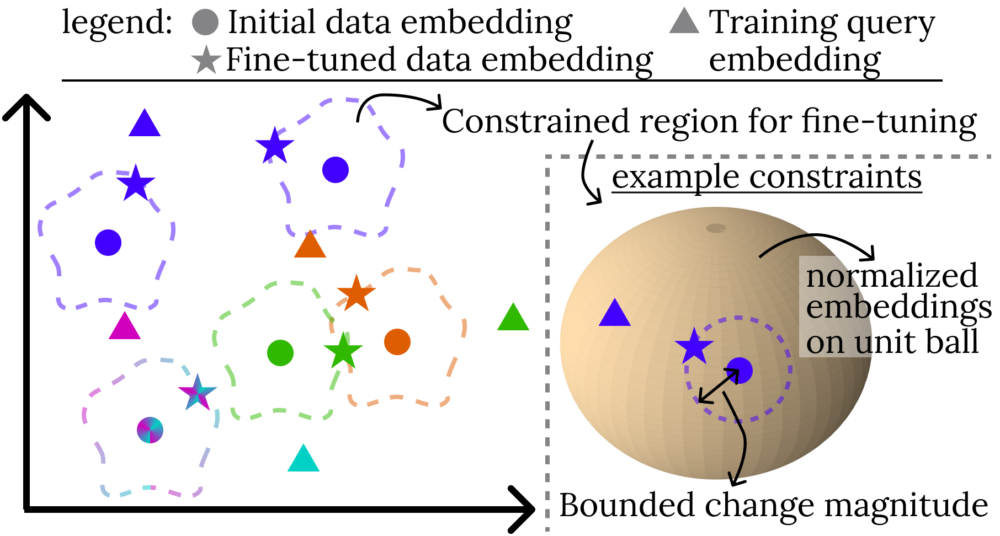
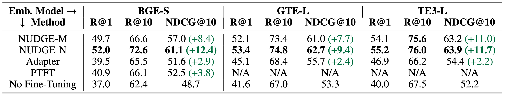
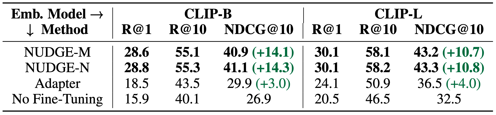

 
Retrieval based on pre-trained embedding similarity is the standard approach for developing RAG pipelines that incorporate external data sources, including documents, images, tables, and text. And yet, out of the box, these models perform very poorly, retrieving data records that are often completely unrelated to the queries.

We’ve developed NUDGE, a simple and lightweight fine-tuning method that boosts accuracy when retrieving text/images using semantic similarity with pre-trained embedding models. In a nutshell, NUDGE directly modifies the embeddings of data records to maximize the similarity between training queries and their ground-truth answers. NUDGE does so *non-parametrically.* Non-parametric means that NUDGE does not modify model parameters to generate better embeddings, as fine-tuning the embedding model, or training adaptors (e.g., [link](https://docs.llamaindex.ai/en/stable/examples/finetuning/embeddings/finetune\_embedding\_adapter/) or [link](https://docs.llamaindex.ai/en/stable/examples/finetuning/embeddings/finetune\_embedding\_adapter)) would.  Instead, NUDGE *directly* changes the embeddings themselves. Compared with fine-tuning the pre-trained model and training adaptors, NUDGE provides 3.3x and 4.3x higher increase in accuracy and runs 200x and 3x faster, respectively.  

Given these impressive results, we think using NUDGE is a no-brainer – we encourage you to try it out and let us know what you think\! You can read more about the technical details underlying NUDGE [here](https://arxiv.org/abs/2409.02343), or try it out yourself [here](https://github.com/szeighami/nudge/).  We provide more high-level intuition as well as experimental results below.

**The Problem: k-NN Retrieval**  
We have a dataset with a number of data records, each of which can be a text chunk, or an image. *k*\-NN retrieval first embeds each data record as a *d*\-dimensional vector. Embedding is done using a pre-trained embedding model, e.g., OpenAI’s text embedding model for text, or CLIP for images. To answer a query, *k*\-NN retrieval similarly embeds the query and returns the top-*k* data records whose embeddings have the highest similarity to the query embedding, where typically cosine similarity is used as the similarity metric. For the purpose of fine-tuning, we additionally are given a training query set, where for each query we know its ground-truth answer(s). 

**The NUDGE Approach**  
NUDGE changes the data embeddings based on the training set *non-parametrically* to create fine-tuned data embeddings. That is, it does not modify the model parameters, as fine-tuning the pre-trained model or training adaptors would. Instead, it modifies the data record embeddings themselves to maximize the similarity between queries and their ground-truth answers. 

*Why is a non-parametric approach helpful?* A non-parametric fine-tuning approach is extremely lightweight by design. It only requires updating the data embeddings based on mathematically derived formulas, as opposed to, for example, fine-tuning the embedding model, which requires training resources equivalent to training the embeddings in the first place. Meanwhile, our experiments show that NUDGE’s simple update rules are more effective and efficient than fine-tuning the pre-trained model or training adaptors.

*How does this work?* NUDGE derives its update rules by solving constrained optimization problems. The objective is to change data embeddings to maximize the similarity between queries and their ground-truth answers. However, changing the data embeddings *too much* can lead to overfitting the training queries and losing the semantics captured in the data embeddings. To avoid that, NUDGE adds constraints on how the data embeddings can change. The figure below shows this process.

<figure>
  
  <figcaption>Figure 1. NUDGE changes data embeddings within a constrained region (shown in dashed lines) to maximize similarity with training queries. Data embeddings are colored based on queries for which they are the ground-truth answers.</figcaption>
</figure>

As the figure shows, data embeddings are moved toward the training queries for which they are the ground-truth answers to maximize the similarity between the two. Meanwhile, how the embeddings can change is constrained to avoid overfitting. An example of the constraints used is also shown in the figure. The constraint (1) forces the new embeddings to be normalized (i.e., the new embeddings fall on the unit ball), and (2) bounds the magnitude of change to the embeddings.  

*Variants of the approach.* In the paper, we present two methods NUDGE-N and NUDGE-M. NUDGE-N optimally solves the constraint optimization problem described above. NUDGE-M solves a variant that only considers constraint (2) above, allowing the new embeddings not to be normalized. We present closed-form solutions for both, leading to simple formulas for fine-tuning the embeddings.

**Experimental Evaluation**  
We performed experiments on various embedding models and datasets, for both text and image retrieval.  

**Embedding Models**. For text, we use BGE-small ([link](https://huggingface.co/BAAI/bge-small-en-v1.5)), GTE-large ([link](https://huggingface.co/Alibaba-NLP/gte-large-en-v1.5)), and OpenAI’s text-embedding-large-3 ([link](https://platform.openai.com/docs/guides/embeddings/embedding-models)), respectively referred to as BGE-S, GTE-L and TE3-L. For image retrieval, we use two CLIP variants ([link](https://arxiv.org/abs/2103.00020)), ViT-B/32 and ViT-L/14, respectively referred to as CLIP-B and CLIP-L. 

**Datasets**. We present results on standard text retrieval datasets (SciFacts, Fever, ArguAna,TriviaQA, HotpotQA, Natural Questions and NF-Corpus, datasets available [here](https://huggingface.co/sepz)) and image retrieval datasets ([COCO](http://cocodataset.org) and [Flickr](https://huggingface.co/datasets/nlphuji/flickr30k)). See the paper for dataset details.

**Baselines**. We compare results with training an adaptor model to transform the output of the pre-trained model, referred to as Adaptor, and fine-tuning the pre-trained model itself, referred to as PTFT.

<figure>
  
  <figcaption>Table 1. Average accuracy across text datasets (R@k is Recall@k) . PTFT cannot be run on TE3-L since the model is closed-source and OpenAI does not provide an embedding fine-tuning API. It also cannot be run on GTE-L within a reasonable time frame with a single GPU.</figcaption>
</figure>

<figure>
  
  <figcaption>Table 2. Average accuracy across image datasets (R@k is Recall@k).</figcaption>
</figure>

**Results.** NUDGE variants consistently outperform other fine-tuning methods (see Tables 1-2). NUDGE-N provides, on average across datasets and for all embedding models, around 10-14% increase in NDCG@10. PTFT and Adaptor, on the other hand, only improve accuracy by at most 4%. 

<figure>
  
  <figcaption>Table 3. Run time of different methods on BGE-S using an NVIDIA A100 or a 32-core CPU, excluding time to embed the documents.</figcaption>
</figure>

Perhaps surprisingly, NUDGE provides this substantial accuracy boost *while running only in a few minutes even on a CPU*. On CPU, NUDGE is more than 7x faster than Adaptor, while PTFT cannot be run on a CPU. On GPU, it is, respectively, 3x and 200x faster. 

**Summary**  
We presented NUDGE—a simple lightweight fine-tuning method that fine-tunes embeddings in minutes on a CPU, and consistently provides 10-15% accuracy boosts. To fine-tune embeddings, NUDGE directly modifies embeddings to narrow the gap between queries and data, instead of changing the embedding models. It does so by solving constrained optimization problems and deriving mathematical formulae to update embeddings. This leads to simple, efficient, and extremely effective update rules to fine-tune embeddings. NUDGE your embeddings for optimized retrieval [here](https://github.com/szeighami/nudge/), and read more [here](https://arxiv.org/abs/2409.02343). We’d love to hear any feedback\! 
